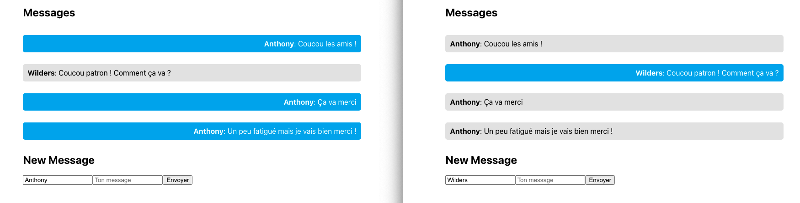

# TP sur les websockets

Nous allons manipuler les websokets avec React & Node.js.

Nous utilisons le paquage [socket.io](https://socket.io/) qui fait très bien le travail !

Voilà à quoi ressemblera un serveur websocket

